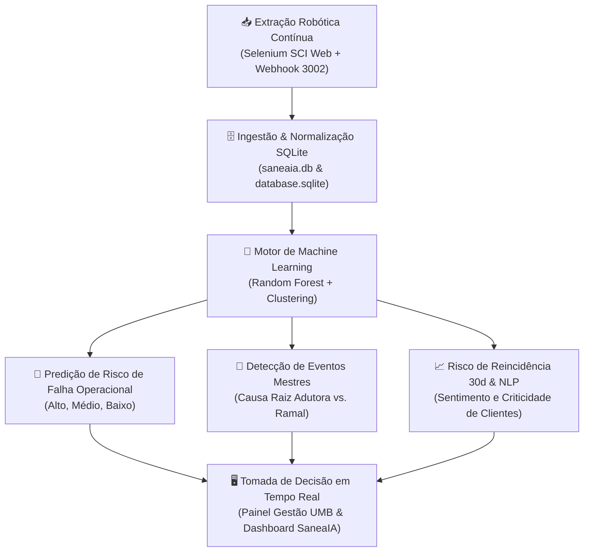
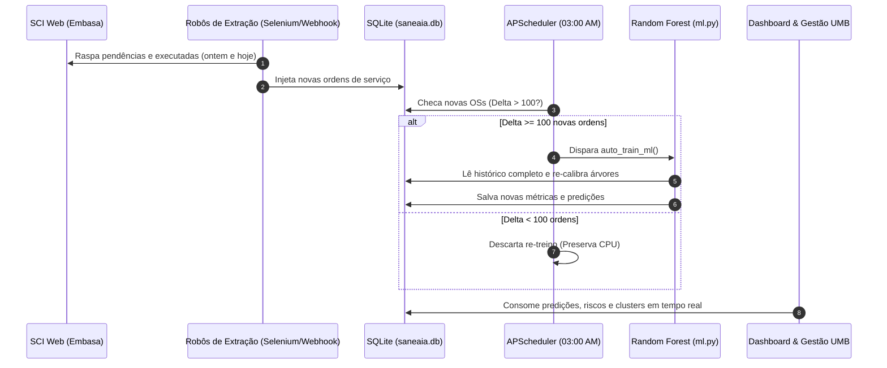

# 🤖 ARQUITETURA ROBÓTICA & MACHINE LEARNING (SANEAIA)
### Plataforma de Inteligência Operacional para Saneamento — EMBASA UMB
**Responsável Técnico / Desenvolvedor:** Gleisson Santos — Embasa UMB  
**Versão do Ecossistema:** 2.5 (Produção Local & Resiliente)

---

## 🧭 1. Visão Geral e Propósito Estratégico

No setor de saneamento básico, a atuação tradicional das equipes de campo é historicamente **reativa**: espera-se o cliente ficar sem água, ligar para o teleatendimento, uma ordem de serviço (OS) ser despachada e uma viatura ir até o local para diagnosticar o problema. Muitas vezes a equipe chega ao imóvel e se depara com portão trancado, hidrômetro inacessível ou percebe que o problema não era no cavalete, mas sim uma despressurização de toda a rede distribuidora do bairro.

A **Camada Robótica e de Machine Learning do SaneaIA** foi desenvolvida para quebrar esse paradigma, transformando a gestão operacional da UMB em um modelo **preditivo, proativo e autônomo**:



---

## ⚙️ 2. Mapa dos Scripts: Qual estamos usando de verdade?

Para evitar confusões entre protótipos experimentais e a esteira de produção, a tabela abaixo mapeia cada script do projeto e sua função exata:

| Arquivo / Script | Status | O que faz no sistema? |
| :--- | :---: | :--- |
| **[`3 - Saneaia/api/routes/ml.py`](file:///C:/Users/t034183/Desktop/UMBMAS/3%20-%20Saneaia/api/routes/ml.py)** | 🟢 **PRODUÇÃO OFICIAL** | **Motor Ativo de ML.** Executa o treinamento da Floresta Aleatória (`train_random_forest_task`), calcula o progresso dinâmico (0% a 100%), salva os modelos `.pkl` no disco, serve métricas JSON e calcula o risco de falha nas OSs abertas (`/api/ml/predict`). |
| **[`3 - Saneaia/api/scheduler_jobs.py`](file:///C:/Users/t034183/Desktop/UMBMAS/3%20-%20Saneaia/api/scheduler_jobs.py)** | 🟢 **PRODUÇÃO OFICIAL** | **Agendador Robótico Noturno (APScheduler).** Executa automaticamente todo dia às 03:00 AM. Avalia se entraram mais de 100 novas ordens de serviço concluídas no SQLite e dispara o re-treino autônomo. |
| **[`3 - Saneaia/api/ml/clustering.py`](file:///C:/Users/t034183/Desktop/UMBMAS/3%20-%20Saneaia/api/ml/clustering.py)** | 🟢 **PRODUÇÃO OFICIAL** | **Clusterer Hidráulico Espaço-Temporal.** Agrupa ocorrências em raio de 48h por setor e logradouro para identificar se uma série de chamados é uma quebra geral de rede ou obstrução isolada. |
| **[`3 - Saneaia/agent/analyzer.py`](file:///C:/Users/t034183/Desktop/UMBMAS/3%20-%20Saneaia/agent/analyzer.py)** | 🟢 **PRODUÇÃO OFICIAL** | **Motor Preditivo Cirúrgico.** Função `analyze_single_demand()` utilizada pelo Painel Gestão UMB (Coluna 2) para calcular probabilidade de reincidência, histórico da matrícula (15d, 6m, 12m) e diagnóstico NLP de sentimento da observação. |
| `3 - Saneaia/ml/training.py` | 🟡 *Laboratório Modular* | Script de pesquisa inicial para testar *Gradient Boosting* e *Random Forest* isoladamente via linha de comando. |
| `3 - Saneaia/ml/features.py` | 🟡 *Laboratório Modular* | Script de engenharia com 50+ variáveis (ratios temporais, one-hot encoding amplo). |
| `3 - Saneaia/ml/pipeline.py` | 🟡 *Laboratório Modular* | Pipeline CLI para orquestrar ingestão -> treino -> persistência fora da API FastAPI. |
| `3 - Saneaia/ml/prediction.py` | 🟡 *Laboratório Modular* | Módulo de predição em lote em terminal (substituído pelo endpoint `/api/ml/predict` em `ml.py`). |

---

## 🌲 3. O Modelo em Produção: Random Forest Classifier

O algoritmo principal em produção no menu **Machine Learning** é uma **Floresta Aleatória de Árvores de Decisão (*Random Forest Classifier*)** do `scikit-learn`.

### A. Parâmetros Matemáticos de Configuração
* **Algoritmo:** `sklearn.ensemble.RandomForestClassifier`
* **Quantidade de Árvores (`n_estimators`):** `100` árvores operando em ensemble (voto majoritário ponderado).
* **Profundidade Máxima (`max_depth`):** `10` níveis (limita o crescimento excessivo das árvores, prevenindo *overfitting* ou memorização rasa).
* **Paralelismo de Hardware (`n_jobs`):** `-1` (utiliza todos os núcleos lógicos e físicos do processador da máquina local, acelerando o treinamento de 40 mil registros para poucos segundos).
* **Reprodutibilidade (`random_state`):** `42` (garante convergência e consistência estatística entre treinos).

### B. Variáveis de Entrada (Features / X)
O modelo aprende as probabilidades a partir de:
1. **Bairro Codificado (`bairro_encoded`):** Transformação matemática dos 48+ bairros da UMB via `LabelEncoder`.
2. **Serviço Solicitado (`servico_encoded`):** Identificador numérico do serviço (ex: *364 - Falta d'água no imóvel*, *37 - Visita*, vazamento de ramal predial, etc.).

### C. A Variável Alvo (Target / y)
O que o modelo tenta prever?
$$	ext{Target} = egin{cases} 1 & 	ext{Ordem Efetivamente Concluída / Resolvida em Campo} \ 0 & 	ext{Ordem Cancelada / Não Executada / Fracasso Operacional} \end{cases}$$

O modelo calcula a probabilidade matemática complementar:
$$	ext{Probabilidade de Falha} = (1.0 - P(	ext{sucesso})) 	imes 100$$

### D. Faixas de Risco Operacional para OSs Abertas
Quando a rotina de predição é executada, cada OS em aberto recebe uma etiqueta de criticidade:
* 🔴 **ALTO RISCO ($\ge 70\%$ de probabilidade de falha):** Grande tendência de improcedência, portão trancado ou necessidade de intervenção especial de rede.
* 🟡 **MÉDIO RISCO ($40\%$ a $69\%$):** Atendimento intermediário recomendando confirmação prévia com o cliente.
* 🟢 **BAIXO RISCO ($< 40\%$):** Atendimento rotineiro com alta taxa de resolução direta.

---

## 🌊 4. O Modelo de Agrupamento Hidráulico (Clustering)

Implementado no script [`3 - Saneaia/api/ml/clustering.py`](file:///C:/Users/t034183/Desktop/UMBMAS/3%20-%20Saneaia/api/ml/clustering.py), o **HydraulicClusterer** realiza mineração espaço-temporal contínua:

1. **Janela Temporal:** Varredura em lote das últimas 48 horas de tramitação.
2. **Cluster Espacial:** Agrupa solicitações com base na chave composta `(Setor, Logradouro)`.
3. **Classificação Automática de Eventos:**
   * **MASTER_EVENT (Evento Hidráulico Mestre):** Quando $\ge 3$ solicitações ocorrem no mesmo trecho. A IA infere a assinatura técnica:
     * *Vazamento em Adutora / Falha de Pressão na Rede* (se coexistirem chamados de vazamento e falta d'água simultâneos).
     * *Oscilação no Abastecimento do Setor* (se houver concentração massiva de falta de pressão).
   * **ISOLATED_DIAGNOSTIC (Diagnóstico Isolado):** Quando há apenas 1 chamado isolado em um trecho estável, indicando alta probabilidade de obstrução local do ramal predial ou cavalete travado.

---

## 💾 5. Onde os Modelos Físicos Ficam Salvos?

Ao final de cada ciclo de treinamento, o sistema gera e atualiza os seguintes artefatos físicos compilados no diretório [`3 - Saneaia/ml/models/`](file:///C:/Users/t034183/Desktop/UMBMAS/3%20-%20Saneaia/ml/models/):

1. 📦 **`random_forest_prod.pkl`**: O arquivo serializado (Pickle) contendo toda a estrutura matemática das 100 árvores de decisão.
2. 📖 **`label_encoders.pkl`**: Os dicionários de codificação categórica que garantem que novos bairros e serviços sejam interpretados exatamente com as mesmas coordenadas do treino.
3. 📄 **`rf_metrics.json`**: Metadados contendo acurácia, precisão, recall, data/hora do treino e total de amostras utilizadas.
4. 🗄️ **Tabela `model_training_history` (SQLite):** Histórico estruturado no `saneaia.db` para plotar a curva de evolução da acurácia no frontend.
5. 🗄️ **Tabela `predicoes_ml` (SQLite):** Tabela que indexa cada `solicitacao_id` com sua respectiva `probabilidade_falha` e nível de `risco`.

---

## 📈 6. Entendendo as Métricas de Desempenho

No card "Status do Modelo" na interface web, são exibidas 4 métricas científicas:

```
+-------------------------------------------------------------------+
|  MÉTRICA        |  O QUE SIGNIFICA NA OPERAÇÃO DA EMBASA?         |
+-------------------------------------------------------------------+
|  Acurácia       |  Percentual geral de acertos entre todas as     |
|                 |  ordens que foram executadas ou canceladas.     |
+-------------------------------------------------------------------+
|  Precisão       |  Quando o modelo crava: "Esta OS vai falhar",   |
|                 |  em qual porcentagem das vezes ele acerta?      |
|                 |  (Minimiza alarmes falsos de falha).            |
+-------------------------------------------------------------------+
|  Recall         |  De todas as ordens que realmente deram errado  |
|  (Sensibilidade)|  em campo, quantas o modelo conseguiu captar?   |
+-------------------------------------------------------------------+
|  Amostras       |  Volume de ordens concluídas históricas         |
|                 |  ingeridas para ajustar os nós das árvores.     |
+-------------------------------------------------------------------+
```

---

## 🤖 7. A Camada de Robótica Autônoma (Zero-Touch)

O sistema opera de maneira totalmente autônoma sem exigir intervenção humana diária:



### Regra do Threshold Inteligente (Validação de Volume)
Para evitar que o processador gaste energia re-treinando o modelo após a entrada de apenas 1 ou 2 ordens insignificantes, o script [`api/scheduler_jobs.py`](file:///C:/Users/t034183/Desktop/UMBMAS/3%20-%20Saneaia/api/scheduler_jobs.py) aplica a regra do **Delta de Amostras**:
* Compara as amostras atuais com o valor registrado em `rf_metrics.json`.
* Se `novos_dados < 100`, a rotina emite um log informativo e descarta o processamento.
* Se `novos_dados >= 100`, ele ativa a esteira completa e atualiza os pesos da IA.

---

## 🎯 8. Conclusão: O Impacto Real no Campo

A camada de Robótica e Machine Learning do **SaneaIA** não é apenas um painel de gráficos: ela atua como um **filtro inteligente de despacho operacional**. 

Ao sinalizar antecipadamente quais ordens correm risco de não serem atendidas e quais logradouros estão à beira de uma crise de desabastecimento em massa, o sistema permite que a equipe da EMBASA UMB:
1. Agende atendimentos difíceis com o cliente por telefone antes de enviar o veículo;
2. Direcione caminhões-pipa preventivos para escolas e hospitais antes que os reservatórios sequem;
3. Acione equipes de manutenção pesada e geofonamento noturno exatamente no epicentro da falha de rede;
4. Reduza os custos com combustível, horas extras e retrabalho de campo.
