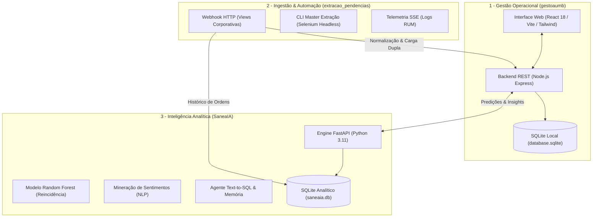

<div align="center">

# PAINEL OPERACIONAL UMB & SANEAIA
### Plataforma Integrada de Gestão Operacional, Ingestão de Dados e Inteligência Analítica Preditiva para Saneamento Básico

**Empresa Baiana de Águas e Saneamento S.A. — EMBASA**  
Unidade Metropolitana de Salvador / Buraquinho (UMB)

```
Versão: 2.4.0  |  Licença: MIT (Uso Institucional)  |  Classificação: Confidencial / Proprietário
```

---

</div>

> **AVISO DE CONFIDENCIALIDADE E REPOSITÓRIO PRIVADO**  
> Este repositório contém código-fonte, modelos analíticos e rotinas operacionais de uso interno exclusivo da EMBASA. A reprodução, distribuição externa ou utilização não autorizada é estritamente proibida.

---

<div align="center">

## 1. Visão Geral da Arquitetura

</div>

O ecossistema é estruturado em três pilares desacoplados e interoperáveis, projetados tanto para operação local em estações de trabalho quanto para implantação conteinerizada em clusters corporativos Kubernetes / OpenShift:



---

<div align="center">

## 2. Detalhamento dos Módulos do Sistema

</div>

### Módulo 1: Painel Gerencial de Gestão (`1 - gestoaumb`)
Interface executiva para tomada de decisão e acompanhamento operacional em tempo real:
* **Frontend:** React 18, TypeScript, Vite, Tailwind CSS, componentes shadcn/ui e visualizações Recharts.
* **Backend de Dados:** Node.js com Express e persistência de alta vazão em SQLite local (`database.sqlite`).
* **Indicadores Monitorados:**
  * Falta d'Água: Solicitações pendentes (*Aberta* / *Programada*) e solicitações concluídas (*Executada* / *Não Executada*).
  * Pavimentação: Recomposição asfáltica e paralelo com controle de prazos e materiais.
  * Vazamentos: Detecção de vazamentos em rede e ramal por criticidade e tempo de atendimento.
  * Carro-Pipa: Controle de atendimentos emergenciais complementares.
* **Conformidade Operacional (POP 01):** Rastreamento de atendimento aos procedimentos padrão e registro estruturado dos motivos de não conformidade (`atende_pop` e `pop_motivo`).
* **Ergonomia e Filtros:** Layout de 3 colunas com recolhimento dinâmico, filtros temporais (ontem, hoje, anual), filtros por localidade e logradouro, exportação gerencial e importação rápida de CSV.

### Módulo 2: Ingestão de Dados e Conectividade (`2 - extracao_pendencias`)
Camada de entrada e sincronização com os sistemas institucionais da Embasa:
* **Webhook HTTP Integrado (`listener_recebimento.py`):**
  * Servidor HTTP nativo na porta `3002` (com proxy reverso no Express na porta `8080/webhook`).
  * Recebe dados brutos das views corporativas da Embasa em formato JSON ou CSV.
  * Executa rotina de **Carga Dupla**: distribui os dados paralelamente no `database.sqlite` (Gestão) e no `saneaia.db` (IA).
  * Dispara automaticamente a reavaliação preditiva da IA ao final de cada lote.
* **Automação de Extração (`master_extracao.py`):**
  * Pipeline automatizado em Selenium WebDriver (Firefox/Gecko) com execução silenciosa em segundo plano (*headless*).
  * Suporte a cancelamento gracioso seguro (*thread-safe*) e seleção dinâmica de períodos.
* **Central de Telemetria e Logs RUM (`/api/extraction/stream`):**
  * Streaming em tempo real via Server-Sent Events (SSE) com cálculo do impacto de novos registros e atualizações.
  * Histórico persistente de execuções acessível via modal na interface web.
* **Protocolo de Expurgo Seguro de Testes:**
  * Endpoint integrado `/api/expurgar-testes` para identificar cargas de homologação (`_TESTE_WEBHOOK`) e expurgar dados de teste sem afetar registros reais.

### Módulo 3: SaneaIA — Inteligência Operacional e Machine Learning (`3 - Saneaia`)
O cérebro analítico e preditivo da plataforma:
* **Engine REST Assíncrona:** Python 3.11 com FastAPI e servidor Uvicorn.
* **Machine Learning Preditivo (Random Forest):**
  * Classificador probabilístico para predição de reincidência de vazamentos e desabastecimento por logradouro e matrícula.
  * Janelas temporais de recorrência: 15 dias, 6 meses, 12 meses e ano calendário corrente.
  * Clusterização espacial para identificação de trechos críticos e priorização de manutenção preventiva.
* **Processamento de Linguagem Natural (NLP):**
  * Mineração semântica das observações técnicas de encerramento de ordens de serviço.
  * Extração de sentimento do cliente, classificação de taxa de urgência e mapeamento de referências de campo.
* **Agente de Inteligência Operacional (Text-to-SQL com Memória):**
  * Assistente de conversação com compreensão de linguagem natural especializado em saneamento.
  * Geração segura de queries SQL diretamente sobre o schema do SQLite analítico.
  * Estrutura de memória de longo prazo (`conversations`, `messages`, `conversation_memory`) com resumos atualizados assincronamente.

---

<div align="center">

## 3. Manual de Instalação e Execução Local

</div>

Este guia fornece o passo a passo para executar o projeto em uma nova máquina a partir do repositório clonado:

### 3.1. Pré-requisitos do Ambiente
* **Node.js** (versão 18.x ou superior) e **npm**
* **Python** (versão 3.10 ou 3.11)
* **Navegador Mozilla Firefox** (necessário apenas caso utilize os robôs de extração local via Selenium)

### 3.2. Clonagem do Repositório
```bash
git clone https://github.com/corefusiion/Painel_UMB.git
cd Painel_UMB
```

### 3.3. Configuração de Variáveis de Ambiente
Copie os modelos de configuração em cada subdiretório:
```bash
# Pasta 1: Gestão
copy "1 - gestoaumb\.env.example" "1 - gestoaumb\.env"

# Pasta 2: Extração
copy "2 - extracao_pendencias\.env.example" "2 - extracao_pendencias\.env"

# Pasta 3: SaneaIA
copy "3 - Saneaia\.env.example" "3 - Saneaia\.env"
```

### 3.4. Instalação das Dependências

#### A. Frontend e Backend de Gestão (`1 - gestoaumb`)
```bash
cd "1 - gestoaumb"
npm install
cd ..
```

#### B. Módulo de Ingestão e Extração (`2 - extracao_pendencias`)
```bash
cd "2 - extracao_pendencias"
python -m venv venv
venv\Scripts\activate
pip install -r requirements.txt
deactivate
cd ..
```

#### C. Módulo SaneaIA (`3 - Saneaia`)
```bash
cd "3 - Saneaia"
python -m venv venv
venv\Scripts\activate
pip install -r requirements.txt
deactivate
cd ..
```

---

<div align="center">

## 4. Como Iniciar o Ecossistema

</div>

### Opção A: Inicialização Unificada (Recomendada no Windows)
Na raiz do projeto, execute o script em lote:
```bat
start-servers.bat
```
O script iniciará automaticamente quatro terminais paralelos:
1. **Backend Gestão (Express):** `http://localhost:3001`
2. **Frontend Gestão (Vite):** `http://localhost:8080`
3. **API SaneaIA (FastAPI):** `http://localhost:8000`
4. **Webhook Receiver:** `http://localhost:3002` (também exposto em `http://localhost:8080/webhook`)

Para desligar todos os serviços simultaneamente e liberar as portas de rede:
```bat
stop-servers.bat
```

### Opção B: Inicialização Manual por Terminal

| Serviço | Diretório | Comando de Execução | Porta | URL de Acesso |
| :--- | :--- | :--- | :--- | :--- |
| **Frontend Gestão** | `1 - gestoaumb` | `npm run dev` | **8080** | [http://localhost:8080](http://localhost:8080) |
| **Backend Gestão API** | `1 - gestoaumb` | `npm run server` | **3001** | [http://localhost:3001](http://localhost:3001) |
| **SaneaIA Engine** | `3 - Saneaia` | `venv\Scripts\python.exe main.py` | **8000** | [http://localhost:8000](http://localhost:8000) |
| **Webhook Receiver** | `2 - extracao_pendencias` | `python listener_recebimento.py` | **3002** | [http://localhost:3002/webhook](http://localhost:3002/webhook) |

---

<div align="center">

## 5. Manual Operacional de Extração de Dados (`master_extracao.py`)

</div>

Quando não houver alimentação direta via Webhook das views corporativas da Embasa, os dados podem ser extraídos diretamente do sistema legado (**SCI Web**) através do robô de automação com navegador Firefox:

### 5.1. Pré-requisito Obrigatório: Filtros Personalizados no SCI Web
O robô de automação Selenium baseia-se na abertura das **Preferências de Filtros do Usuário** no SCI Web (`form-filtroAcss-btnOpenDlgPrefs`). No SCI Web, o arquivo CSV exportado reflete com exatidão as colunas visíveis na tabela configurada pelo usuário.

> [!IMPORTANT]
> Antes de executar o robô, o operador **deve acessar o SCI Web e salvar as preferências de filtro** contendo as colunas exigidas pelos sistemas. O guia completo de referência está documentado no arquivo [`Colunas filtro.txt`](Colunas%20filtro.txt) na raiz do projeto.

#### Resumo das Colunas por Módulo:

* **Para o Projeto 1 (`1 - gestoaumb` — Gestão de Pendências):**
  * *Filtros:* Falta d'Água (Pendentes), Vazamento, Pavimento e Carro Pipa.
  * *Colunas Necessárias:* `SS`, `Serviço`, `Especificação` (ou `Obs da SS`), `Matrícula`, `Localidade`, `Bairro`, `Logradouro`, `Núm do Imóvel` (ou `CEP`), `Dt/Hr Abertura da SS`, `Sit da OS`, `Unid Atual (OS)`, `Data/Hora Última Tramitação da OS`, `Obs da SS`.

* **Para o Projeto 3 (`3 - Saneaia` — Falta d'Água Executadas e Inteligência Preditiva):**
  * *Filtro:* Falta d'Água Executadas (Concluídas).
  * *Colunas Necessárias:* `SS`, `OS`, `Serviço`, `Especificação`, `Matrícula` (obrigatória para cálculo de reincidência 15d, 6m, 12m), `Localidade`, `Setor`, `Bairro`, `Logradouro`, `Núm do Imóvel`, `CEP`, `Dt/Hr Abertura da SS`, `Conclusão da SS` (ou `Encerramento`), `Obs da SS`, `Obs de Enc da OS` (obrigatória para NLP e conformidade com POP 01), `Sit da OS`, `Data/Hora Última Tramitação da OS`, `Unid Atual (OS)`.

### 5.2. Onde Preencher as Credenciais de Acesso (`.env`)
Para que o Selenium realize a autenticação com sucesso no SCI Web, o usuário deve preencher o usuário e senha institucional no arquivo `.env`.

* **Local do arquivo:** `2 - extracao_pendencias/.env` (ou no arquivo `.env` na raiz do projeto `Painel_UMB`).
* **Parâmetros a preencher:**
  ```env
  SCI_USER=seu_usuario_embasa
  SCI_PASSWORD=sua_senha_embasa
  ```
> [!NOTE]
> O robô Selenium está programado para verificar automaticamente tanto a pasta local `2 - extracao_pendencias/.env` quanto o `.env` da raiz do repositório, garantindo inicialização imediata.

### 5.3. Execução do Script Mestre
Abra um terminal na pasta `2 - extracao_pendencias` com o ambiente virtual ativado:
```bash
cd "2 - extracao_pendencias"
venv\Scripts\python.exe master_extracao.py
```

### 5.4. Menu Interativo e Fases de Execução
O terminal exibirá o menu mestre com as seguintes opções operacionais:

* **[1] Executar Ciclo Completo de Extração (Recomendado):**
  1. *Fase 1 (Pendências):* Acessa o SCI Web e extrai todas as solicitações pendentes de Falta d'Água, Pavimento e Vazamentos.
  2. *Pausa Técnica (3s):* Higienização e liberação de memória dos drivers de navegação.
  3. *Fase 2 (Executadas):* Extrai o lote de solicitações de Falta d'Água concluídas no período selecionado.
  4. *Fase 3 (Detalhes da OS e Recálculo da IA):* Percorre cada ordem executada extraindo as vistorias técnicas e observações de encerramento, gravando no SQLite e acionando o recálculo imediato do SaneaIA.
* **[2] Extrair Somente Falta d'Água Executadas:** Executa apenas a coleta das ordens de serviço encerradas.
* **[3] Extrair Detalhes de OS Pendentes:** Coleta observações de encerramento de ordens que ainda não possuem detalhes arquivados.
* **[4] Extrair Somente Pendências Ativas:** Coleta as demandas abertas no momento.
* **[5] Iniciar Agendador Automático:** Ativa execução recorrente com intervalo programado (ex: a cada 60 minutos).

### 5.5. Filtros de Período Suportados
Ao selecionar extrações com período, o script permite escolher:
* **[1] Ontem e Hoje (Padrão Operacional):** Coleta as ordens do dia corrente e do dia anterior.
* **[2] Últimos 3 dias:** Janela ampliada para fechamento de fins de semana.
* **[3] Últimos 7 dias:** Recomposição semanal consolidada.

---

<div align="center">

## 6. Persistência de Dados e Funcionamento dos Bancos SQLite

</div>

O ecossistema utiliza arquitetura baseada em bancos de dados relacionais embarcados em SQLite de alta velocidade:

1. **`1 - gestoaumb/database.sqlite` (Banco de Gestão):**
   * Armazena as tabelas operacionais: `faltadagua`, `faltadagua_ex`, `vazamentos`, `pavimentos`, `carro_pipa`, `ai_insights_faltadagua` e sessões de usuários.
   * O arquivo já se encontra estruturado no repositório. Caso necessário reinicializar o esquema do zero, execute `npx tsx backend/seed.ts` dentro de `1 - gestoaumb`.

2. **`3 - Saneaia/database/saneaia.db` (Banco Analítico da IA):**
   * Armazena as tabelas de inteligência: `solicitacoes`, `detalhes_os`, `conversations`, `messages` e `conversation_memory`.
   * O banco já possui os schemas, índices e modelos calibrados. Caso queira recriar as tabelas e views estruturais em um banco limpo, execute `python database/setup_sqlite.py` dentro de `3 - Saneaia`.

---

<div align="center">

## 7. Conformidade com a LGPD e Segurança de Dados

</div>

O ecossistema foi desenvolvido em estrita observância à **Lei Geral de Proteção de Dados (Lei Federal nº 13.709/2018)**:
* **Minimização Estrita:** Apenas identificadores operacionais (SS, OS, matrícula técnica do imóvel e logradouro) são processados.
* **Ausência de Dados Sensíveis:** O sistema **não coleta e não armazena** CPF, RG, dados bancários, informações de saúde ou quaisquer dados pessoais sensíveis.
* **Isolamento no Controle de Versão:** Arquivos brutos de dados proprietários, backups e credenciais estão permanentemente excluídos do repositório através de regras rigorosas no `.gitignore`.
* Para diretrizes completas de governança, consulte o documento [`SECURITY.md`](./SECURITY.md).

---

<div align="center">

## 8. Implantação Corporativa em Nuvem (Kubernetes / Red Hat OpenShift)

</div>

O ecossistema é 100% conteinerizado e possui manifestos prontos para deploy direto no cluster **Red Hat OpenShift (OCP)** ou Kubernetes corporativo da EMBASA:

* **Arquitetura de Contêineres:**
  * **Painel de Gestão (`gestao-app`):** Imagem Node.js 20 Alpine com compilação otimizada do frontend e backend Express (porta `3001`). Atua como Web Gateway seguro.
  * **Motor Analítico SaneaIA (`saneaia-app`):** Imagem Python 3.11-slim executando FastAPI com Uvicorn (porta `8000`), Random Forest e mineração NLP.
  * **Receptor Webhook (`webhook-app`):** Imagem Python 3.11-slim (porta `3002`) para recepção unificada de views corporativas.
* **Teste Local com Docker Compose:**
  * Execute `docker compose up -d` na raiz para inicializar todo o ecossistema com rede interna e volume de dados compartilhado.
* **Manifestos Oficiais OpenShift:**
  * Toda a especificação de infraestrutura (`01-pvc.yaml`, `02-configmap.yaml`, `Deployments`, `Services` e `Routes` com terminação TLS/HTTPS) está disponível no diretório [`openshift/`](./openshift/) com seu guia passo a passo em [`openshift/README.md`](./openshift/README.md).
* **Documentação de Auditoria Técnica e POP 01:**
  * O mapeamento minucioso dos 32 campos de vistoria de campo, regras de conformidade e exceções contextuais está documentado em [`DETALHES_OS_E_POP01.md`](./DETALHES_OS_E_POP01.md).

---

<div align="center">

**Desenvolvido por Gleisson Santos**  
EMBASA — Unidade Metropolitana de Salvador / Buraquinho (UMB)  
Licença MIT • 2026

</div>

