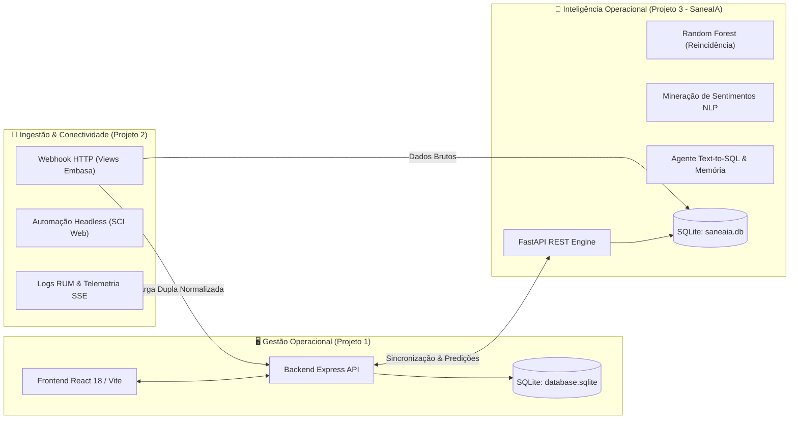

# 💧 Painel Operacional UMB & SaneaIA
### Plataforma Integrada de Gestão Operacional, Ingestão de Dados e Inteligência Artificial Preditiva para Saneamento Básico

**Desenvolvido por:** Gleisson Santos - Embasa UMB  
**Organização:** EMBASA - Empresa Baiana de Águas e Saneamento S.A.  
**Unidade:** UMB (Unidade Metropolitana de Salvador / Buraquinho)  
**Ano:** 2026  
**Licença:** MIT (Uso Interno Institucional)  

> [!IMPORTANT]
> **REPOSITÓRIO PRIVADO E PROPRIETÁRIO**  
> Este repositório contém código-fonte, modelos analíticos e rotinas operacionais de uso estrito e confidencial da Empresa Baiana de Águas e Saneamento S.A. (EMBASA). A reprodução, distribuição externa ou utilização não autorizada é estritamente proibida.

---

## 📌 1. Visão Geral do Sistema

O **Painel Operacional UMB & SaneaIA** é um ecossistema corporativo completo para gestão e apoio à tomada de decisão operacional no saneamento. O sistema integra visualização analítica em tempo real, conectividade com sistemas legados via Webhook e automação, e um motor avançado de inteligência artificial preditiva e processamento de linguagem natural (NLP).

O projeto é estruturado em **3 pilares desacoplados**:



---

## 🏗️ 2. Detalhamento dos Módulos

### 📊 Módulo 1: Painel Gerencial de Gestão (`1 - gestoaumb`)
Interface visual de alto desempenho para acompanhamento e controle de serviços de campo em tempo real:
* **Tecnologias:** React 18, Vite, TypeScript, Tailwind CSS, shadcn/ui, Recharts, Lucide Icons.
* **Backend de Alta Performance:** Node.js com Express e persistência local ultrarrápida em SQLite (`database.sqlite`).
* **Indicadores Operacionais em Tempo Real:**
  - **Falta d'Água:** Acompanhamento de pendências ativas (*Aberta* e *Programada*) e solicitações concluídas (*Executadas* e *Não Executadas*).
  - **Pavimentação:** Monitoramento de recomposição asfáltica e paralelo com controle de prazos.
  - **Vazamentos de Rede e Ramal:** Priorização por criticidade e tempo de atendimento.
  - **Carro-Pipa:** Gestão de abastecimentos emergenciais complementares.
* **Conformidade com Procedimentos Operacionais (POP):** Mapeamento do POP 01 com rastreabilidade de motivos de não conformidade (`atende_pop` e `pop_motivo`).
* **Recursos Avançados de Interface:**
  - Layout ergonômico responsivo de 3 colunas com recolhimento inteligente.
  - Filtros dinâmicos por ano, mês, localidade, bairro e logradouro.
  - Modais de detalhes da ordem de serviço com exibição de fotos, vistorias e observações de encerramento expandidas.
  - Exportação gerencial e importação de planilhas CSV.

---

### 📡 Módulo 2: Ingestão de Dados e Conectividade (`2 - extracao_pendencias`)
Camada responsável por alimentar o ecossistema com dados atualizados dos sistemas corporativos da Embasa:
* **Webhook HTTP de Ingestão Direta (`listener_recebimento.py`):**
  - Recebe cargas de dados em formato JSON ou CSV diretamente das *Views* corporativas da Embasa (ex: via porta `8080/webhook` ou `3002`).
  - Executa rotina de **Carga Dupla**: normaliza e distribui os registros simultaneamente no banco operacional (`database.sqlite`) e no banco analítico de IA (`saneaia.db`).
  - Dispara automaticamente a reavaliação preditiva da IA assim que novos lotes chegam.
* **Automação Headless de Extração (`master_extracao.py` / `ExtractionManager`):**
  - Robôs em Selenium WebDriver (Firefox/Gecko) com execução 100% silenciosa em segundo plano (*headless*).
  - Suporte a cancelamento gracioso via thread-safe events (`cancel_event`).
* **Central de Telemetria e Logs RUM (`/api/extraction/stream`):**
  - Streaming em tempo real via Server-Sent Events (SSE) com cálculo do impacto real de registros novos e atualizados no SQLite.
  - Histórico persistente de execuções acessível via modal na interface web.
* **Rotina de Expurgo Seguro de Testes:**
  - Mecanismo integrado para identificar cargas com a assinatura `_TESTE_WEBHOOK` e expurgar dados de homologação com 1 clique, sem afetar dados reais de produção.

---

### 🧠 Módulo 3: SaneaIA - Inteligência Operacional e Machine Learning (`3 - Saneaia`)
O motor analítico e cognitivo especializado no setor de saneamento:
* **API REST Assíncrona:** Desenvolvida em Python 3.11 com FastAPI e servidor Uvicorn.
* **Machine Learning Preditivo (Random Forest Classifier):**
  - Predição probabilística de risco de reincidência de vazamentos e desabastecimento por logradouro e matrícula.
  - Análise temporal de recorrência em múltiplas janelas: **15 dias**, **6 meses**, **12 meses** e **ano calendário corrente**.
  - Clusterização automática de trechos e logradouros críticos para apoio a manutenções preventivas.
* **Processamento de Linguagem Natural (NLP):**
  - Mineração semântica das observações de encerramento preenchidas pelas equipes de campo.
  - Análise de sentimento (positivo/negativo), cálculo de taxa de urgência e extração automática de pontos de referência e impedimentos.
  - Painéis comparativos independentes para a visão do **Mês Atual** vs. **Acumulado Anual**.
* **Agente de Inteligência Operacional com Text-to-SQL e Memória:**
  - Assistente virtual especializado em saneamento que traduz perguntas em linguagem natural diretamente para consultas SQL otimizadas.
  - Junções automáticas com as regras do POP 01 e cálculos pré-agregados.
  - **Memória Persistente de Longo Prazo:** Estrutura relacional no SQLite (`conversations`, `messages`, `conversation_memory`) com resumos gerados assincronamente e persistência de sessão no navegador.
  - Interface moderna estilo editorial com sidebar de histórico, controle de conversas (fixar, renomear, excluir) e atalhos rápidos.

---

## 🔒 3. Segurança e Conformidade com a LGPD

O ecossistema adota padrões rigorosos de segurança e privacidade em conformidade com a **Lei Geral de Proteção de Dados (Lei Federal nº 13.709/2018)**:
* **Minimização de Dados:** Coleta e processamento estritamente limitados a dados técnicos de ordens de serviço e planejamento hidráulico.
* **Sem Dados Sensíveis:** O sistema não armazena CPF, RG, dados bancários ou quaisquer dados pessoais sensíveis.
* **Isolamento no Git:** Bases proprietárias (`Base dados UMB/`, `dados_brutos/`) e arquivos de segredos (`.env`) estão permanentemente ignorados no controle de versão.
* Para mais detalhes, consulte o arquivo [`SECURITY.md`](./SECURITY.md).

---

## ☸️ 4. Prontidão para Kubernetes / OpenShift (Infraestrutura Corporativa)

A aplicação foi desenhada com arquitetura desacoplada e modular, estando **100% pronta para implantação em contêineres Docker/OCI** na infraestrutura corporativa da EMBASA:
* **Frontend:** Servido via contêiner Nginx (Alpine) com compressão gzip e cache estático.
* **Backend Gestão:** Contêiner Node.js 20 (Alpine).
* **Backend SaneaIA:** Contêiner Python 3.11-slim com FastAPI e dependências de ML instaladas.
* **Comunicação Interna:** Tráfego de alta velocidade pela rede interna do cluster com rotas HTTP corporativas e sem restrições de firewall de máquinas locais.

---

## 🚀 5. Execução em Ambiente Local (Windows)

### Pré-requisitos
* **Node.js** (versão 18 ou superior)
* **Python** (versão 3.10 ou superior)
* **Navegador Firefox** (caso utilize o robô local de extração)

### Inicialização Rápida
Execute o inicializador unificado na raiz do repositório:
```bat
start-servers.bat
```
O script abrirá quatro janelas sincronizadas:
1. **Backend Express de Gestão** (`http://localhost:3001`)
2. **Frontend React/Vite** (`http://localhost:8080`)
3. **API FastAPI SaneaIA** (`http://localhost:8000`)
4. **Webhook Receiver HTTP** (`http://localhost:3002` / `http://localhost:8080/webhook`)

### Links de Acesso Local
* **Painel de Gestão Operacional:** [http://localhost:8080](http://localhost:8080)
* **Dashboard Técnico SaneaIA:** [http://localhost:8000](http://localhost:8000)
* **Documentação da API SaneaIA (Swagger):** [http://localhost:8000/docs](http://localhost:8000/docs)
* **Emulador e Testador de Webhook:** [http://localhost:8080/testar-webhook.html](http://localhost:8080/testar-webhook.html)

---

## 📄 6. Licença e Créditos

Desenvolvido por **Gleisson Santos** para a **EMBASA - Unidade Metropolitana de Salvador (UMB)**.  
Distribuído sob a Licença MIT para fins de uso, adaptação e operação institucional interna. Consulte o arquivo [`LICENSE`](./LICENSE) para mais informações.

